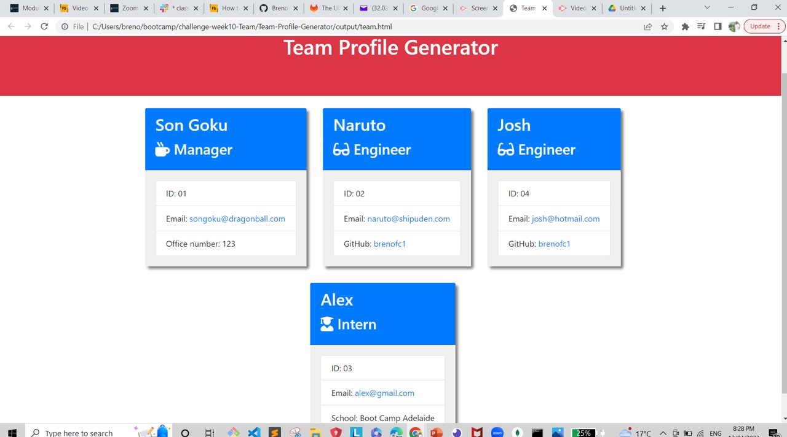

# Unit 10: OOP Team Profile Generator
## Description

The target of this project was to develop a app where the manage could generate a webpage to display some info from the company's team (employees).

## Table of Contents

- [User Story](#user-story)
- [Acceptance Criteria](#acceptance-criteria)
- [Screenshot](#screenshot)
- [Walkthrough Video](#walkthrough-video)

# User Story

```md
AS A manager
I want to be able to generate a webpage that can displays my team's basic information as ID, Role, Email, etc.
Then I can have access to some necessary information as github, email, school, etc.
```

## Acceptance Criteria

```md
Given a command-line application that accepts user input,
When prompted for team member information,
Then an HTML file is generated to display a formatted team roster based on the input.
When clicking on an email address in the HTML,
Then the default email program is launched, populating the 'To' field with the email address.
When clicking on a GitHub username,
Then the corresponding GitHub profile opens in a new tab.
When starting the application,
Then the user is prompted to enter the team manager’s name, employee ID, email address, and office number.
When team manager’s information is entered,
Then a menu with the option to add an engineer, an intern, or finish building the team is presented.
When selecting the engineer option,
Then the user is prompted to enter the engineer’s name, ID, email, and GitHub username, and is taken back to the menu.
When selecting the intern option,
Then the user is prompted to enter the intern’s name, ID, email, and school, and is taken back to the menu.
When deciding to finish building the team,
Then the application exits, and the HTML team roster is generated.
```

## Screenshot
This is a screenshot of the generated HTML webpage.



## Walkthrough Video


